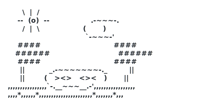

# `01001000 01101001` &nbsp;•&nbsp; Hi, I'm Anas 🌿

**A quiet garden grown from ones and zeros.**

---

### 🌱 In this garden

- 🛠️ I grow small, tidy command-line tools — one job each, no dependencies.
- 🐟 The koi are my repos: **Go** utilities, **C++** utilities, and a little **Svelte + Go** crypto dashboard.
- 🌊 The lake is data — I like turning APIs into clean, cached JSON and honest charts.
- 🍃 Everything here is planted to be readable first, clever second.

### 🌳 Featured patches

| Patch | What grows there |
|------|------------------|
| 🌊 [crypto-dashboard-api](https://github.com/anasbelbaz/crypto-dashboard-api) · [web](https://github.com/anasbelbaz/crypto-dashboard-web) | Go API + Svelte charts for live crypto prices |
| 🔧 [gouuid](https://github.com/anasbelbaz/gouuid) · [gohash](https://github.com/anasbelbaz/gohash) · [gojsonfmt](https://github.com/anasbelbaz/gojsonfmt) | Tiny Go CLI utilities |
| 🧰 [cppmorse](https://github.com/anasbelbaz/cppmorse) · [cpproman](https://github.com/anasbelbaz/cpproman) · [cppsnake](https://github.com/anasbelbaz/cppsnake) | C++ utilities & a terminal Snake game |

### 🌻 Toolshed

🌾 The banner above is a real SVG — every tree, fish and ripple is a colored <code>0</code> or <code>1</code>. 
Regenerate it with <code>python3 gen_garden.py</code>. 🌾

